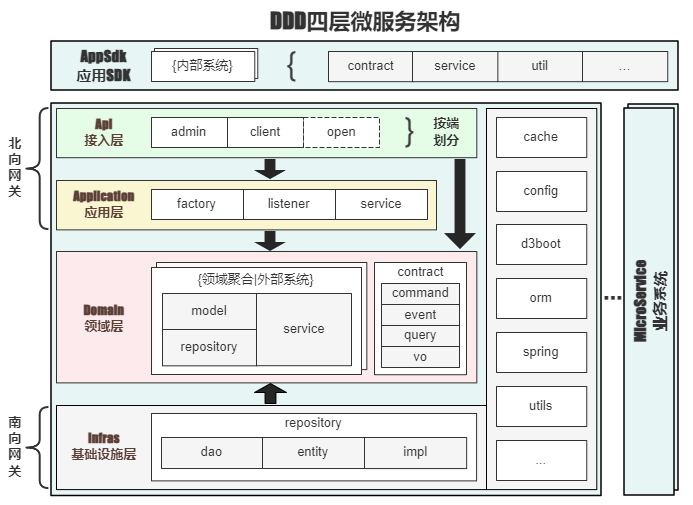

<h1 align="center" style="margin: 30px 0 30px; font-weight: bold;">D3boot基础框架</h1>
<h4 >基于Spring Boot、Spring Cloud & Alibaba的DDD风格微服务基础框架，框架组件包括：<br>
一、d3boot框架<br>
1. base: 基础组件<br>
    1) base-core: 基础核心组件<br>
    2) base-data: 基础数据组件<br>
    3) base-mq: 基础MQ组件<br>
    4) base-kit: 基础工具箱<br>
    5) base-monitor: 基础监控组件<br>
    6) base-web: 基础WEB组件<br>
2. base-bom: 基础依赖组件<br>
3. base-parent: 业务父工程组件<br>
二、ddd-demo: 基于框架搭建的Demo工程<br>
笔者在开发过程中不断汲取前辈的优秀代码经验，融入自己的代码特色，提炼高复用性代码，并对中间件进行浅封装。旨在快速搭建SaaS业务系统，减少繁琐的CRUD定义，
减少不必要的xml代码书写，通过对Model、Query对象的继承，即可实现你想要的CRUD，提高整体代码效率。</h4>
<p >
	点击头像进入源码空间：<a href="https://github.com/sfgwfn1402/d3-boot"></a>
</p>
<h3>整体设计理念：简洁、灵活、包容</h3>

## 一、DDD架构说明

### DDD架构图



### 架构思想

- 经典DDD四层架构：作为主要骨架，其他优秀架构思想作指导
- 整洁架构思想：应用到DDD领域层与基础设施层，接口与实现拆到不同层，把技术代码与业务代码分离
- 菱形架构思想：内部以领域层的领域模型为核心，向南北两个方向发散
- CQRS架构思想：按命令模型（command）与查询模型（query）分离职责
- D3boot基础框架：作为基础设施，提供基础CRUD接口、BOM基础依赖、基础工具箱等浅封装，应用在各层简化链接，是快速搭建系统的粘合剂

### 各层说明

- 接入层：对外提供的系统入口/接口，如放Controller类，按端划分（这里client放客户端接口，admin放管理端接口，open放开放接口）
- 应用层：跨聚合的服务编排service.XxxAppService，事件监听器event.XxxListener，实体工厂factory.XxxFactory
- 领域层：定义核心业务规则，与具体技术无关，不依赖其他各层；服务内按领域聚合或外部系统（微服务）划分；model定义充血模型、值对象，repository定义仓库接口，service定义聚合内的领域服务；领域契约contract包含：API层命令对象command.XxxCommand、查询对象query.XxxQuery、API特殊出参vo.XxxVO、领域事件event.XxxEvent等
- 基础设施层：具体技术相关的代码/框架、仓库层实现repository.impl.XxxRepositoryImpl，包括数据聚合实现

## 二、工程结构

```
d3boot   
├── base                             // 基础组件
│   ├── base-core                    // 基础核心组件
│   │   ├── context                  // 核心上下文
│   │   ├── contract                 // 核心契约
│   │   └── utils                    // 核心工具
│   ├── base-data                    // 基础数据组件
│   │   ├── annotation               // 数据注解
│   │   ├── config                   // 数据配置
│   │   ├── plugin                   // 数据插件
│   │   ├── repository               // 数据仓库
│   │   ├── typehandlers             // 类型处理器
│   │   └── utils                    // 数据工具
│   ├── base-kit                     // 基础工具箱
│   │   ├── cache                    // 缓存工具
│   │   ├── event                    // 事件工具
│   │   ├── lang                     // 语言工具
│   │   ├── thread                   // 线程工具
│   │   └── web                      // WEB工具
│   ├── base-monitor                 // 基础监控组件（基于DDD四层架构）
│   │   ├── api                      // 接入层
│   │   ├── application              // 应用层
│   │   │   └── service              // 应用服务
│   │   ├── domain                   // 领域层
│   │   │   ├── contract             // 领域契约
│   │   │   ├── code                 // 代码信息聚合
│   │   │   ├── dingding             // 钉钉系统聚合（按系统命名聚合）
│   │   │   ├── qiwei                // 企微系统聚合（按系统命名聚合）
│   │   │   └── robot                // 机器人领域聚合（按模块命名聚合）
│   │   │       ├── model            // 机器人领域模型
│   │   │       └── service          // 机器人领域服务
│   │   └── infras                   // 基础设施层
│   │       ├── config               // 配置
│   │       └── utils                // 工具
│   ├── base-mq                      // 基础MQ组件
│   │   ├── config                   // MQ配置
│   │   └── kafka                    // Kafka实现
│   │       ├── annotation           // MQ注解
│   │       ├── core                 // MQ核心包
│   │       │   └── serialization    // 序列化器
│   │       └── impl                 // MQ实现
│   └── base-web                     // 基础WEB组件
│       ├── annotation               // WEB注解
│       ├── auth                     // 基础认证模块
│       │   ├── annotation           // 认证注解
│       │   ├── config               // 认证配置
│       │   └── inteceptor           // 认证请求拦截器
│       ├── config                   // WEB配置
│       ├── core                     // WEB核心组件
│       ├── inteceptor               // WEB拦截器
│       └── utils                    // WEB工具
├── base-bom                         // 基础依赖组件
│   └── pom.xml                      // 基准版本依赖管理POM
├── base-parent                      // 业务工程/SDK工程父工程组件
│   └── pom.xml                      // 业务工程/SDK工程父POM
├── ddd-demo                         // 基于DDD四层架构的Demo工程
│   ├── api                          // 接入层（访问入口，放各端的Controller等）
│   ├── application                  // 应用层（应用层，放复杂业务）
│   │   ├── factory                  // 实体工厂（对复杂实体做转换、构建）
│   │   ├── listener                 // 事件监听器
│   │   └── service                  // 应用服务（跨聚合业务编排、事务控制）
│   ├── domain                       // 领域层（核心业务，与具体技术无关）
│   │   ├── contract                 // 领域契约（放领域级别的约定类）
│   │   │   ├── config               // 领域配置（放领域级别的业务配置）
│   │   │   ├── constants            // 常量定义（如枚举类、常量类）
│   │   │   ├── command              // 命令对象（可作为API层的增删改入参）
│   │   │   ├── query                // 查询对象（可作为API的查询入参）
│   │   │   ├── event                // 领域事件定义
│   │   │   └── vo                   // API响应结果
│   │   ├── erp(例)                  // ERP系统聚合（外部上下文，按系统命名）
│   │   │   ├── model                // ERP领域模型（放领域对象、VO值对象）
│   │   │   └── service              // ERP领域服务（系统上下文内业务实现）
│   │   ├── user(例)                 // 用户领域聚合（内部聚合，按聚合命名）
│   │   │   ├── model                // 用户领域模型（放领域对象、VO值对象）
│   │   │   ├── repository           // 用户仓库（定义仓库接口，不关注技术实现）
│   │   │   └── service              // 用户聚合领域服务（聚合内业务实现）
│   └── infras                       // 基础设施层（与具体技术实现相关）
│       ├── config                   // 配置（放系统级别的技术配置）
│       ├── repository               // 数据仓库
│       │   ├── dao                  // 数据访问
│       │   ├── entity               // 数据实体
│       │   │   └── typehandlers     // 自定义类型处理器
│       │   └── impl                 // 数据仓库实现
│       └── utils                    // 工具类
│       XxxApplication               // 系统启动入口
└── pom.xml
```

## 三、使用说明

### 第一步

Clone代码到本地，添加为Maven工程，修改为自己的私服地址并Deploy部署

### 第二步

**集成方式一**

顶层pom.xml继承base-parent组件，快速搭建新业务服务/SDK服务（已集成base-bom）

```
……
<parent>
    <groupId>com.d3framework</groupId>
    <artifactId>base-parent</artifactId>
    <version>1.0.0-SNAPSHOT</version>
</parent>
……
```

**集成方式二**

顶层pom.xml集成base-bom依赖管理，统一第三方依赖包版本

```
……
<dependencyManagement>
    <dependencies>
        <dependency>
            <groupId>com.d3framework</groupId>
            <artifactId>base-bom</artifactId>
            <version>1.0.0-SNAPSHOT</version>
            <type>pom</type>
            <scope>import</scope>
        </dependency>
    </dependencies>
</dependencyManagement>
……
```

### 第三步

module包pom.xml按需引入base基础组件依赖，集成度高的组件无需再引入已集成的组件

```
……
<!--基础核心组件-->
<dependency>
    <groupId>com.d3framework</groupId>
    <artifactId>base-core</artifactId>
</dependency>
<!--基础数据组件（含基础核心组件）-->
<dependency>
    <groupId>com.d3framework</groupId>
    <artifactId>base-data</artifactId>
</dependency>
<!--基础工具箱（含基础核心组件）-->
<dependency>
    <groupId>com.d3framework</groupId>
    <artifactId>base-kit</artifactId>
</dependency>
<!--基础监控组件（含基础核心组件、基础工具箱）-->
<dependency>
    <groupId>com.d3framework</groupId>
    <artifactId>base-monitor</artifactId>
</dependency>
<!--基础MQ组件（含基础核心组件、基础工具箱）-->
<dependency>
    <groupId>com.d3framework</groupId>
    <artifactId>base-mq</artifactId>
</dependency>
<!--基础WEB组件（含基础核心组件）-->
<dependency>
    <groupId>com.d3framework</groupId>
    <artifactId>base-web</artifactId>
</dependency>
……
```
